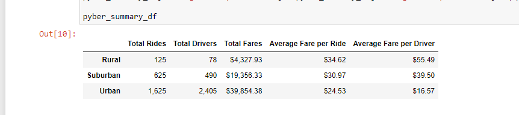
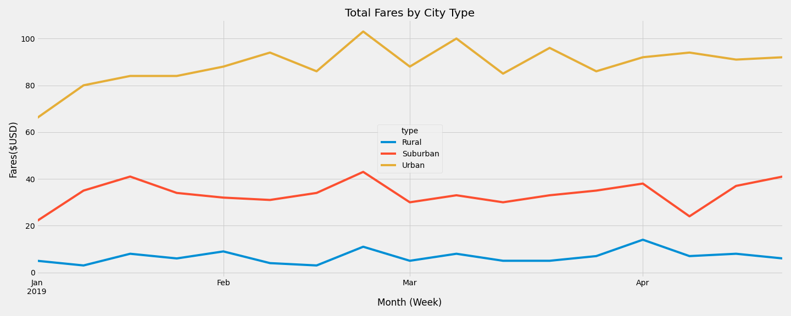

# Overview of PyBer_Analysis
The purpose of this analysis was to create visualizations of rideshare data for PyBer to help improve access to ride-sharing services and determine affordability for underserved neighborhoods.

## Results
As shown below, the difference in ride sharing data for each city type is considerable. Urban ride counts are double that of Suburban and over 10 times that of Rural. Ride counts appear to be a correlation with total fare amounts as well as average fare per ride.

It also appears that the total fares for the urban cities are much higher than Rural and Suburban city types throughout the entire year.

## Summary
One recommendation I would provide to the CEO of PyBer would be to conside fare costs across all city types. The data shows that the average fare per driver in Urban cities is a lot lower being that there are more rides than drivers. I would recommend lowering the amount of drivers in the urban areas to raise the average fair per driver.

Another recommendation I would offer is to investigate why there is such a low driver count in rural areas. Is the demand there?